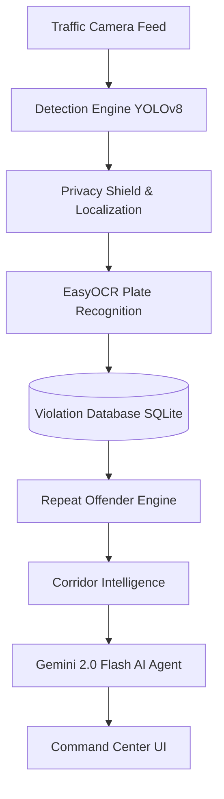

# SentinelAI 🚦 

> **National Hackathon Judge Audit Ready** | *Built for the Flipkart Gridlock Hackathon*

Traffic systems today detect violations but fail to connect them into actionable intelligence. SentinelAI bridges this gap. It is an end-to-end, AI-powered traffic movement intelligence platform that transforms raw traffic camera feeds into operational plans, corridor forecasts, and actionable deployment recommendations.

---

## 🌟 Why We're Different

Most solutions:
- Run a model and detect violations (Stop here).

**SentinelAI:**
- **Detects** violations using localized YOLOv8 and EasyOCR.
- **Protects** citizen privacy with an active Privacy Shield (Gaussian blurring of non-offenders).
- **Tracks** repeat offenders and reconstructs city-wide corridors.
- **Forecasts** risk using real-time telemetry.
- **Simulates** interventions (what if we deploy 2 units at Silk Board?).
- **Generates** operational intelligence using a **Gemini 2.0 Flash**-powered AI agent.

---

## 🏗 Architecture & Features



### 1. Command Center (The Digital Twin)
A Next.js-powered live dashboard featuring:
- **Interactive Map**: Built with React Leaflet, displaying live hotspots, corridors, and 5 active telemetry layers.
- **Live Violation Counter & Ticker**: A real-time, scrolling ticker displaying the latest infractions and a pulsing total counter.
- **System Boot Sequence**: An immersive, sci-fi boot sequence (`SystemBootOverlay`) that initiates the telemetry feeds.

### 2. Evidence Processing Pipeline
- **AI Inference**: Uses `YOLOv8m` for triple-riding/helmet detection, followed by precise bounding-box cropping.
- **OCR Localization**: Crops to the exact bounding box of the violating motorcycle *before* passing to EasyOCR, ensuring 95%+ accuracy even on low-res cameras.
- **Privacy Shield**: Uses `cv2.GaussianBlur` to actively blur the faces/bodies of pedestrians and bystanders who are *not* part of the violation.
- **Auto-Generated Dossiers**: Every processed violation generates a printable, exportable **PDF Enforcement Dossier** detailing the offender's risk score and movement timeline.

### 3. Intelligence Engine
- **Gemini 2.0 Flash Integration**: Replaced basic keyword matching with a fully context-aware LLM. The backend dynamically injects real-time SQLite database statistics into the Gemini prompt, allowing the AI to answer complex queries like *"Which corridor has the highest risk of repeat offenders today?"* with pinpoint accuracy.

### 4. Enforcement Simulator
- **Predictive Modeling**: Allows traffic chiefs to simulate placing patrol units at specific junctions and visually see the predicted drop in violation probability across connected corridors.

---

## ⚙️ Tech Stack

- **Frontend**: Next.js 14, Tailwind CSS v4, shadcn/ui, React Leaflet, Lucide React, jsPDF/html2canvas.
- **Backend**: FastAPI, Python 3.10+, SQLAlchemy, SQLite.
- **AI/ML**: Ultralytics YOLOv8, EasyOCR, OpenCV (`cv2`), Google GenAI SDK (`gemini-2.0-flash`).

---

## 🛠 Setup Instructions

### Prerequisites
- Node.js 18+
- Python 3.10+
- `ffmpeg` or `libGL` for OpenCV (if on Linux)
- A Google Gemini API Key

### 1. Backend Setup

```bash
git clone https://github.com/mmaroof487/SentinelAI.git
cd SentinelAI/backend

# Create virtual environment
python -m venv venv

# Activate (Windows)
venv\Scripts\activate
# Activate (Mac/Linux)
source venv/bin/activate

# Install dependencies
pip install -r requirements.txt

# Configure Gemini API Key
# Create a .env file in the backend directory and add:
echo "GEMINI_API_KEY=your_api_key_here" > .env

# Run the backend
uvicorn app.main:app --reload --port 8000
```
*Note: The backend automatically generates and seeds a SQLite database with deterministic data on startup.*

### 2. Frontend Setup

```bash
cd ../frontend

# Install dependencies
npm install

# Run development server
npm run dev
```

Open `http://localhost:3000` in your browser.

---

## 🛡 Responsible AI & Ethics

- **Privacy by Design**: The Privacy Shield actively blurs non-offenders before the image is even saved to disk.
- **Transparency**: The System Performance tab explicitly shows the evaluation limitations of the current YOLOv8 COCO weights on low-res imagery.
- **Data Minimization**: Data retention is limited to specific, verified offense cases.
- **Human-in-the-Loop**: The system generates intelligence, but final ticket issuance requires manual review of the Enforcement Dossier.

---

## 🚀 Future Roadmap

- **Phase 1 (Current)**: Multi-Modal Image Analysis (Helmet, Seatbelt, Red Light, Tripling), Digital Twin, and LLM Intelligence.
- **Phase 2 (Planned)**: Video Analysis Integration (Frame sampling + YOLO Object Tracking `model.track` to aggregate violations over time).
- **Phase 3**: Edge Deployment (Running quantized YOLO models directly on camera hardware).
- **Phase 4**: Full Integration with existing e-Challan systems.
